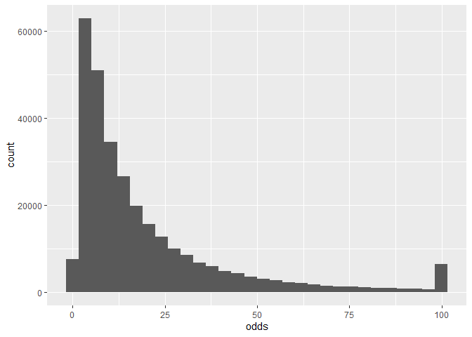

Cleaning And Transforming Dutch Horse Racing Data from ndr.nl
================

#### Set directory of this notebook as working directory

``` r
setwd(dirname(rstudioapi::getSourceEditorContext()$path))
```

# 1 Load packages and Data

``` r
library(tidyverse)
```

    ## ── Attaching core tidyverse packages ──────────────────────── tidyverse 2.0.0 ──
    ## ✔ dplyr     1.1.2     ✔ readr     2.1.4
    ## ✔ forcats   1.0.0     ✔ stringr   1.5.0
    ## ✔ ggplot2   3.4.3     ✔ tibble    3.2.1
    ## ✔ lubridate 1.9.2     ✔ tidyr     1.3.0
    ## ✔ purrr     1.0.2     
    ## ── Conflicts ────────────────────────────────────────── tidyverse_conflicts() ──
    ## ✖ dplyr::filter() masks stats::filter()
    ## ✖ dplyr::lag()    masks stats::lag()
    ## ℹ Use the conflicted package (<http://conflicted.r-lib.org/>) to force all conflicts to become errors

``` r
csv_paths <- list.files("./data", full.names = TRUE)
results_csvs <- lapply(
  csv_paths, read.csv, header = TRUE, encoding = "utf-8", 
  colClasses = c("integer", rep("character", 20))
)
races_nl <- bind_rows(results_csvs)
```

``` r
# give columns new names
c_names <- c(
  "ndr_id", "date_track", "time", "race_number", "title", 
  "description1", "description2", "description3", "race_infos",
  "position", "horse", "driver", "distance", "startnummer", "startnr", "draw", 
  "red_km_str", "dist_btn", "Hcap", "prize_money", "odds"
)
colnames(races_nl) <- c_names
```

# 2 Columns

Column descriptions:

- ndr_id: An ID which is used by ndr.nl internally to identify the
  individual horse racing events (race days).

- date_track: Date of the race and racecourse on which the race took
  place.

- time: Time of day at which the race took place.

- race_number: The races are numbered but there are also races without
  numbers which are qualifiers.

- title: Title of the race.

- description1: Description of the conditions under which the race took
  place.

- description2 and description3: Used in the description of the
  conditions of flat races.

- race_infos: Infos about discipline of the race, distance to run, and
  type of start.

- position: Finishing position of the horse in the race.

- horse: Name of the horse.

- driver: Name of the driver (or jockey for flat races).

- distance: Distance to be run by the specific horse. It can differ from
  the distance of the race (better horses sometimes have to run a
  slightly longer distance in Bandenstart-races)

- startnummer and startnr: Two different column names used by ndr.nl.
  Both have the same meaning (bib number of the horse).

- draw: Only used in flat races to indicate the stall number of the
  starting gate for the horse in this race.

- red_km_str: [Réduction
  kilométrique](https://www.zone-turf.fr/definition/reduction-kilometrique-99.html)
  as a string which is just the average pace per km of the horse in this
  race. The string looks like this for example: ‘1.15,6’ (so the length
  of this string should normally be 6 characters)

- dist_btn: Distance to the winning horse at finish measured in horse
  lengths (only used in flat races).

- Hcap: Weight carried or Handicap rating of the horse (since it is only
  used in flat races and I am interested in harness races I have not
  looked into the real meaning of this number in the context of dutch
  horse races).

- prize_money: Money won by the horse in the race.

- odds: Odds (used for betting purposes).

## 2.1 “ndr_id”

We can just leave that one alone.

## 2.2 “race_infos” and new column discipline

We are only interested in the harness racing results. So the first thing
we could do is filter for the discipline “Drafsport”.

``` r
# Adding new column "discipline"
races_nl <- races_nl %>% 
  mutate(discipline = gsub(" -.*", "", race_infos))
unique(races_nl$discipline)
```

    ## [1] "Drafsport" "Rensport"

``` r
races_nl <- races_nl %>% 
  filter(discipline == "Drafsport")
```

## 2.3 “date_track”

The date_track column contains two types of information and we should
separate them. Before that we should check that all values for
“date_track” follow the same pattern.

``` r
races_nl %>% 
  filter(!grepl("\\d{2}-\\d{2}-\\d{2}, .*$", date_track))
```

    ##  [1] ndr_id       date_track   time         race_number  title       
    ##  [6] description1 description2 description3 race_infos   position    
    ## [11] horse        driver       distance     startnummer  startnr     
    ## [16] draw         red_km_str   dist_btn     Hcap         prize_money 
    ## [21] odds         discipline  
    ## <0 rows> (or 0-length row.names)

``` r
races_nl <- races_nl %>% 
  separate(col = date_track, into = c("date", "racecourse"), sep = ", ")
unique(races_nl$racecourse)
```

    ##  [1] "Wolvega"         "Nootdorp"        "Hilversum"       "Duindigt"       
    ##  [5] "Alkmaar"         "Drachten"        "Groningen"       "Assendelft"     
    ##  [9] "Wognum"          "Venhuizen"       "Hoogkarspel"     "Warmond"        
    ## [13] "Uitgeest"        "Emmeloord"       "Zandvoort"       "Stompwijk"      
    ## [17] "Voorschoten"     "Santpoort"       "Beverwijk"       "Noordwijk"      
    ## [21] "de Lier"         "Hoorn"           "Schagen"         "Heemskerk"      
    ## [25] "Purmerend"       "Hillegom"        "Medemblik"       "Enkhuizen"      
    ## [29] "Roden"           "Lisse"           "Middenbeemster"  "Joure"          
    ## [33] "t Zand"          "Amsterdam-Noord" "IJmuiden"        "Aduard"         
    ## [37] "Sassenheim"      "Eenrum"          "Zwanenburg"      "Utrecht"        
    ## [41] "Bennebroek"      "Leek"            "Egmond"          "Bemmel"         
    ## [45] "Helmond"         "Wateringen"      "Schiermonnikoog" "Hattemerbroek"  
    ## [49] "Slovenië"        "Heino"           "Hoofddorp"       "Rotterdam"

## 2.4 “race_number”

``` r
sort(unique(races_nl$race_number))
```

    ##  [1] "0"  "1"  "10" "11" "12" "13" "14" "15" "16" "2"  "20" "21" "22" "23" "24"
    ## [16] "25" "26" "27" "28" "29" "3"  "4"  "5"  "6"  "7"  "8"  "9"  "KW"

Those are some crazy numbers. I have never been to the races and have
watched a 21st race on that day. Actually those are codes for canceled
races.

``` r
crazy_rnumbers <- c("0", as.character(20:29))
races_nl %>% 
  filter(race_number %in% crazy_rnumbers) %>% 
  distinct(title)
```

    ##               title
    ## 1 Koers geannuleerd

So we could safely get rid of the canceled races.

``` r
races_nl <- races_nl %>% 
  filter(! race_number %in% crazy_rnumbers)
```

## 2.5 Dropping columns used for flat racing results

After a glimpse at the data we can safely assume that “description2” and
“description3” are only used for flat racing results.

``` r
races_nl %>% 
  summarise(
    #vars("description1", "description2", "description3"), mean(str_length)
    mean_strlen_desc1 = mean(str_length(description1)),
    mean_strlen_desc2 = mean(str_length(description2)),
    mean_strlen_desc3 = mean(str_length(description3))
  )
```

    ##   mean_strlen_desc1 mean_strlen_desc2 mean_strlen_desc3
    ## 1          47.89361                 0                 0

Others columns only used for flat racing results: draw, dist_btn, Hcap.
Drop columns for flat racing altogether

``` r
races_nl <- races_nl %>% 
  select(ndr_id:description1, race_infos:startnr, red_km_str, prize_money, odds)
```

## 2.6 “prize_money”

We are going to store currency values in the data frame as an integer
and in our case Euro-Cents. At first we could check if there are values
for prize money which don’t follow the two expected patterns: “” (empty
string) and “€ .\*”

``` r
races_nl %>% 
  filter(!grepl("^€ .*$|^$", prize_money)) %>% 
  select(ndr_id, race_number, horse, prize_money)
```

    ## [1] ndr_id      race_number horse       prize_money
    ## <0 rows> (or 0-length row.names)

Build new column “prize_eurcents”.

``` r
races_nl <- races_nl %>% 
  mutate(
    # replace empty strings with "0"
    prize_eurcents = if_else(prize_money == "", "0", prize_money),
    # convert to euro cents
    prize_eurcents = as.integer(gsub("€ |\\.|,", "", prize_eurcents))
  )
```

## 2.7 “startnummer” and “startnr”

In both of these columns we would expect numbers and only numbers.

``` r
sort(unique(races_nl$startnummer))
```

    ##  [1] ""   "1"  "10" "11" "12" "13" "14" "15" "16" "17" "18" "19" "2"  "20" "21"
    ## [16] "22" "23" "24" "3"  "4"  "5"  "6"  "7"  "8"  "9"

Do the same for the “startnr”-column:

``` r
sort(unique(races_nl$startnr))
```

    ##  [1] ""   "1"  "10" "11" "12" "13" "14" "15" "16" "17" "18" "19" "1o" "2"  "20"
    ## [16] "21" "22" "23" "24" "25" "26" "27" "28" "3"  "30" "31" "4"  "5"  "6"  "7" 
    ## [31] "8"  "9"  "A"

There are two funny looking values in this field: “A” and “1o”

``` r
races_nl %>% 
  filter(startnr %in% c("A", "1o")) %>% 
  select(ndr_id, race_number, horse, position, startnr, title)
```

    ##   ndr_id race_number            horse position startnr        title
    ## 1  14672           2    Letty Victory        3      1o Paques-prijs
    ## 2  11207           6 Naction Skoatter        9       A Jonker-prijs

The meaning of the “A” is unknown and we should treat it as NA. The “1o”
should obviously mean “10”, so we could just replace it.

``` r
races_nl$startnr <- ifelse(
  races_nl$ndr_id == 14672 & races_nl$race_number == "2" & 
    races_nl$horse == "Letty Victory",
  "10",
  races_nl$startnr
)
```

The “startnummer” and “startnr” have the same meaning obviously.

``` r
races_nl %>% 
  filter(str_length(startnummer) > 0 & str_length(startnr) > 0)
```

    ##  [1] ndr_id         date           racecourse     time           race_number   
    ##  [6] title          description1   race_infos     position       horse         
    ## [11] driver         distance       startnummer    startnr        red_km_str    
    ## [16] prize_money    odds           prize_eurcents
    ## <0 rows> (or 0-length row.names)

New column for starting number: start_no

``` r
races_nl <- races_nl %>% 
  mutate(start_no = as.integer(paste0(startnummer, startnr)))
```

    ## Warning: There was 1 warning in `mutate()`.
    ## ℹ In argument: `start_no = as.integer(paste0(startnummer, startnr))`.
    ## Caused by warning:
    ## ! NAs introduced by coercion

``` r
races_nl %>% 
  filter(
    str_length(startnummer) > 0 | str_length(startnr) > 0, is.na(start_no)
  ) %>% 
  select(ndr_id, race_number, horse, startnummer, startnr, start_no)
```

    ##   ndr_id race_number            horse startnummer startnr start_no
    ## 1  11207           6 Naction Skoatter                   A       NA

``` r
races_nl <- races_nl %>% 
  select(-c(startnummer, startnr))
```

## 2.8 “odds”

Since the Netherlands are in Europe they use commas as decimal
separators. Expected patterns in the odds column are e.g. numbers like
“7,4” or “5” and empty string.

``` r
races_nl %>% 
  filter(!grepl("^\\d+,\\d+$|^\\d+$|^$", odds)) %>% 
  select(ndr_id, race_number, horse, odds)
```

    ##   ndr_id race_number         horse odds
    ## 1  27830           1        Nana W   ,2
    ## 2  41633           5 Brutus Brebro   ,8

In the above case perhaps something went wrong with the data entry of
ndr.nl. We should treat those as NA and later filter out these races
when we need the odds for an analysis.

``` r
races_nl$odds <- ifelse(
  grepl("^,\\d", races_nl$odds), NA, races_nl$odds 
)
```

``` r
sum(is.na(races_nl$odds))
```

    ## [1] 2

Number of empty strings:

``` r
sum(grepl("^$", races_nl$odds))
```

    ## [1] 37870

``` r
races_nl$odds <- as.numeric(gsub(",", "\\.", races_nl$odds))
```

``` r
sum(is.na(races_nl$odds))
```

    ## [1] 37872

``` r
summary(races_nl$odds)
```

    ##    Min. 1st Qu.  Median    Mean 3rd Qu.    Max.    NA's 
    ##    0.00    5.40   11.40   19.27   24.40   99.90   37872

``` r
ggplot(races_nl, aes(x = odds)) +
  geom_histogram()
```

    ## `stat_bin()` using `bins = 30`. Pick better value with `binwidth`.

    ## Warning: Removed 37872 rows containing non-finite values (`stat_bin()`).

<!-- -->

There are several rows which have an odds value below 1. Odds below 1
don’t make sense in horse racing and you would never encounter them.

``` r
races_nl %>% 
  arrange(odds) %>% 
  filter(odds < 1) %>% 
  .$odds %>% 
  unique()
```

    ## [1] 0

We should set those to NA. Odds of 1 do make sense if a very large
amount of money has been bet on this horse. In France odds of 1 would
actually not be possible because the minimum set by PMU is 1.1. So we
shouldn’t encounter odds of 1 in the PMU races at Wolvega. The highest
possible value for odds in our dataset is 99.9. But those odds could
very well be higher. Traditionally the toteboards did not display three
digits before the decimal separator. But for now we shouldn’t change the
values of those high odds because we do not know the exact values and
could only guess them in combination with the odds of the other horses
in the race.

``` r
races_nl$odds <- ifelse(races_nl$odds == 0, NA, races_nl$odds)
```

## 2.9 Inspecting the column ‘red_km_str’

Since the length of the string should be 6 and follow the pattern
described above, we are also interested in strings of length 6 which do
not match the pattern

``` r
races_nl %>% 
  filter(
    !grepl("^\\d\\.\\d{2},\\d$", red_km_str) & str_length(red_km_str) == 6
  ) %>% 
  arrange(red_km_str) %>% 
  .$red_km_str
```

    ##  [1] "1,20.9" "1.16.9" "1.18.9" "1.19.3" "1.19.8" "1.19.9" "1.20.3" "1.20.5"
    ##  [9] "1.20.6" "1.20.6" "1.20.8" "1.22.9" "1.22.9" "1.23.2" "1.23.3" "1.23.3"
    ## [17] "1.23.7" "1.23.8" "1.24.0"

In these cases something went wrong with the data entry at ndr.nl and we
can just transform those values into the expected format.

Substitute comma with dot in “1,20.9”:

``` r
races_nl$red_km_str <- ifelse(
  (!grepl("^\\d\\.\\d{2},\\d$", races_nl$red_km_str) & 
     str_length(races_nl$red_km_str) == 6) & grepl("\\d,", races_nl$red_km_str),
  gsub(",", "\\.", races_nl$red_km_str),
  races_nl$red_km_str
)
```

Substitute second dot with comma in the above cases:

``` r
races_nl$red_km_str <- ifelse(
  !grepl("^\\d\\.\\d{2},\\d$", races_nl$red_km_str) & str_length(races_nl$red_km_str) == 6,
  gsub(
    "\\.(?=\\d$)", ",", races_nl$red_km_str, perl = TRUE
  ),
  races_nl$red_km_str
)
```

## 2.10 Adding column “red_km_sec”

``` r
races_nl %>% 
  filter(str_length(red_km_str) < 6, str_length(red_km_str) > 0) %>% 
  select(ndr_id, race_number, horse, red_km_str)
```

    ##    ndr_id race_number              horse red_km_str
    ## 1    4925          11      Bold Operator       1.18
    ## 2   64035           1            Bendith         GT
    ## 3   64946           2             Wammes        gto
    ## 4   64946           2    Warrior Victory        gto
    ## 5   64946           2 Orlando de Bresles        gto
    ## 6   64946           2           Videx SR        gto
    ## 7   64946           2             Quaden        gto
    ## 8   64946           2   You Wish Toscana        gto
    ## 9   64946           2  Pipo des Gacheres        gto
    ## 10  64946           2       Yoran Sammer        gto
    ## 11  64946           2 Blackpearl Trans R        gto
    ## 12  64946           2         Voltreffer        gto
    ## 13  64946           2    Young Girl Mack        gto

``` r
races_nl %>% 
  filter(ndr_id == 64035, race_number == "1") %>% 
  select(race_number,position, horse, red_km_str)
```

    ##   race_number position           horse red_km_str
    ## 1           1        1 Bokito Starlake     1.23,2
    ## 2           1        2          Barjan     1.23,3
    ## 3           1        3             Ace     1.23,3
    ## 4           1        4     Bianca Lady     1.23,3
    ## 5           1        5     Be Fabulous     1.23,8
    ## 6           1        6     Bazooka Joe     1.25,3
    ## 7           1        7         Bendith         GT
    ## 8           1        A   Beatrice Boko           
    ## 9           1        A        Adagio M

``` r
races_nl %>% 
  filter(str_length(red_km_str) < 6, str_length(red_km_str) > 0) %>% 
  select(ndr_id, race_number, horse, red_km_str) %>% 
  .$red_km_str
```

    ##  [1] "1.18" "GT"   "gto"  "gto"  "gto"  "gto"  "gto"  "gto"  "gto"  "gto" 
    ## [11] "gto"  "gto"  "gto"

``` r
races_nl %>% 
  filter(ndr_id == 4925, race_number == 11) %>% 
  select(ndr_id, race_number, position, horse, red_km_str)
```

    ##   ndr_id race_number position            horse red_km_str
    ## 1   4925          11        1       Gold Arrow     1.18,7
    ## 2   4925          11        2      Desert Bowl     1.18,8
    ## 3   4925          11        3    Bold Operator       1.18
    ## 4   4925          11        4             Emil     1.18,9
    ## 5   4925          11        5  Intact Hornline     1.18,9
    ## 6   4925          11        6        Lass Olly     1.19,0
    ## 7   4925          11        7    Hedy Boekelte     1.19,4
    ## 8   4925          11        8       Vjeselchak     1.19,6
    ## 9   4925          11        A Hugo van Cornjum

The “1.18” should probably be a be a “1.18,8” or a “1.18,9”. We could
just let it go to NA or drop the race entirely. It is a result from
17/08/1997 and we don’t really need the result for later stages of the
analysis because it is really old.

``` r
races_nl$red_km_str <- ifelse(
  races_nl$ndr_id == 4925 & races_nl$race_number == "11" & 
    races_nl$position == "3",
  NA,
  races_nl$red_km_str
)
```

I don’t know what “GT” or “gto” actually means. But I presume that times
have not been taken in this cases and we could just declare it NA.

``` r
races_nl$red_km_str <- ifelse(
  races_nl$red_km_str == "gto" | races_nl$red_km_str == "GT",
  NA,
  races_nl$red_km_str
)
```

``` r
sum(is.na(races_nl$red_km_str))
```

    ## [1] 13

Adding a new column with the pace (réduction kilométrique) measured in
seconds would be a good idea.

``` r
races_nl <- races_nl %>% 
  mutate(
    red_km_sec = as.numeric(gsub("\\..*", "", red_km_str)) * 60 +
      as.numeric(gsub(",", ".", gsub("^.\\.", "", red_km_str))) 
  )
```

``` r
races_nl %>% 
  filter(is.na(red_km_sec)) %>% 
  .$red_km_str %>% 
  unique()
```

    ## [1] "" NA

# 3 Write Data to csv-File
